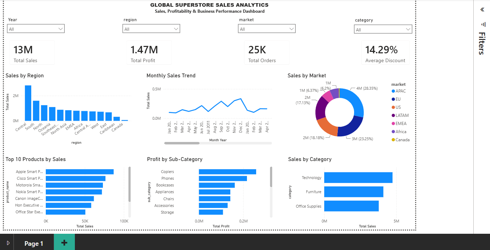

# Global Superstore Sales Analytics

## Project Overview

This project demonstrates an end-to-end business data analytics workflow using a Global Superstore-style e-commerce dataset. The project covers data cleaning, Excel analysis, SQL-based business analysis, and interactive Power BI dashboard development.

The project was completed as part of a Data Analysis internship program with Primeor Solutions.

## Dataset

The cleaned dataset contains **51,271 records** and 21 fields covering orders, customers, products, sales, discounts, profit, shipping, markets, regions, and dates.

### Key Fields

- Order ID and order/ship dates
- Customer and segment
- Market and region
- Category and sub-category
- Product
- Sales, quantity, discount and profit
- Shipping cost and order priority

## Tools & Technologies

- **Microsoft Excel** — data cleaning, pivot tables, charts and summary analysis
- **SQL** — business queries and insight generation
- **Power BI** — interactive dashboard development
- **DAX** — KPI measures and calculations

## Analysis Performed

### Excel Analysis

- Removed duplicate records
- Handled missing/null values
- Standardized inconsistent text values
- Corrected date formats and numerical values
- Calculated total sales, total profit and average discount
- Identified top products and loss-making products
- Performed region, market, category and monthly trend analysis

### SQL Analysis

The SQL analysis covers:

1. Top 10 profitable products
2. Top 10 customers by sales
3. Region-wise total sales
4. Category-wise average profit
5. Highest average discount category
6. Negative-profit orders/order lines
7. Monthly sales trend
8. Market-wise revenue
9. Top-performing sub-categories
10. Shipping-mode usage

The SQL file also contains additional queries for category, region and loss-making product analysis.

> **Note:** The original SQL query file was not retained. The included `.sql` file is a reconstructed portfolio version based on the documented internship task list and the cleaned dataset.

## Power BI Dashboard

### Dashboard Preview

The interactive Power BI dashboard provides an executive view of sales and profitability performance.

### Key Performance Indicators

- Total Sales
- Total Profit
- Total Orders
- Average Discount

### Sales Analysis

- Sales by Region
- Sales by Market
- Monthly Sales Trend
- Sales by Category

### Product & Profitability Analysis

- Top 10 Products by Sales
- Profit by Sub-Category

### Interactive Features

The dashboard includes slicers for:

- Year
- Region
- Market
- Category

These filters allow users to interactively explore sales and profitability performance across different business dimensions.

## Key Results

Based on the cleaned dataset:

- **Total Sales:** approximately **$12.64M**
- **Total Profit:** approximately **$1.47M**
- **Average Discount:** **14.29%**
- **Distinct Orders:** **25,029**
- **Quantity Sold:** **178,242**
- **APAC** generated the highest market sales at approximately **$3.58M**.
- **Central** was the highest-sales region at approximately **$2.82M**.
- **Technology** generated the highest sales among the three categories.
- **Furniture** had the highest average discount at approximately **16.80%**.
- **Standard Class** was the most frequently used shipping mode.
- **Copiers** generated the highest total profit among sub-categories.

## Business Insights

The analysis highlights differences in sales performance across markets, regions, categories and products. The Power BI dashboard enables users to explore these patterns interactively using Year, Region, Market and Category filters.

For additional documented insights, see:

**[Business Insights](business_insights.md)**

## Repository Files

| File | Description |
|---|---|
| `Global_Superstore_Dashboard.png` | Power BI dashboard preview |
| `Global_Superstore_Sales_Analytics.pbix` | Power BI dashboard |
| `Global_Superstore_Excel_Analysis.xlsx` | Excel analysis |
| `global_superstore_analysis.sql` | SQL analysis and business queries |
| `business_insights.md` | Documented business insights |
| `README.md` | Project documentation |

## Skills Demonstrated

**Excel | SQL | Power BI | DAX | Data Cleaning | Data Validation | Business Analytics | Data Visualization | KPI Reporting | Exploratory Data Analysis**
